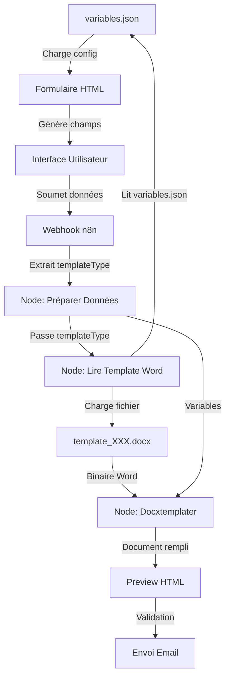

# 🏗️ Architecture du Système de Templates Dynamiques

## 🎯 Principe Fondamental

Le système est conçu pour être **100% dynamique** :
- ✅ Aucune modification du code n8n pour ajouter un template
- ✅ Configuration centralisée dans `variables.json`
- ✅ Chargement dynamique des templates Word
- ✅ Génération automatique du formulaire

---

## 📊 Flux de Données



---

## 🔧 Composants Clés

### **1. Configuration Centralisée (`variables.json`)**

**Rôle :** Source unique de vérité pour tous les templates.

**Structure :**
```json
{
  "variables_communes": {
    "civiliteDestinataire": { ... },
    "nomDestinataire": { ... },
    ...
  },
  "templates": {
    "designation": {
      "nom": "Lettre de Désignation",
      "fichier": "template_designation.docx",
      "variables_specifiques": { ... }
    },
    "negociation": {
      "nom": "Mandat de Négociation",
      "fichier": "template_negociation.docx",
      "variables_specifiques": { ... }
    }
  }
}
```

**Utilisé par :**
- Formulaire HTML (génération des champs)
- Workflow n8n (chargement du template)

---

### **2. Formulaire HTML Dynamique**

**Fichier :** `templates/form/form.html`

**Fonctionnement :**
```javascript
// 1. Charge variables.json au démarrage
async function loadVariablesConfig() {
  const response = await fetch('/config/variables.json')
  variablesConfig = await response.json()
  
  // 2. Remplit le sélecteur de templates
  Object.keys(variablesConfig.templates).forEach(key => {
    const template = variablesConfig.templates[key]
    // Ajoute une option pour chaque template
  })
}

// 3. Génère les champs dynamiquement
function generateFields(templateKey) {
  const template = variablesConfig.templates[templateKey]
  
  // Variables communes (toujours affichées)
  Object.keys(variablesConfig.variables_communes).forEach(...)
  
  // Variables spécifiques (selon le template)
  Object.keys(template.variables_specifiques).forEach(...)
}
```

**Avantage :** Ajouter un template dans `variables.json` = nouveau template disponible automatiquement.

---

### **3. Workflow n8n Dynamique**

#### **Node : "Préparer Données"**

**Type :** `n8n-nodes-base.set`

**Rôle :** Extrait et formate toutes les variables du formulaire.

**Important :** Inclut `typeDocument` qui contient la clé du template choisi.

```javascript
{
  "typeDocument": "designation",  // ← Clé du template
  "civiliteDestinataire": "Monsieur",
  "nomDestinataire": "Dupont",
  ...
}
```

---

#### **Node : "Lire Template Word" (NOUVEAU - Dynamique)**

**Type :** `n8n-nodes-base.function`

**Rôle :** Charge dynamiquement le bon template Word selon `typeDocument`.

**Code :**
```javascript
// 1. Charger la configuration
const fs = require('fs');
const config = JSON.parse(fs.readFileSync('/templates/config/variables.json', 'utf8'));

// 2. Récupérer le type de template
const templateType = $('Preparer Donnees').item.json.typeDocument;

// 3. Trouver le fichier correspondant
const templateFile = config.templates[templateType].fichier;
const templatePath = `/templates/word/${templateFile}`;

// 4. Lire le fichier
const templateBuffer = fs.readFileSync(templatePath);

// 5. Retourner le binaire
return {
  binary: {
    data: {
      data: templateBuffer.toString('base64'),
      mimeType: 'application/vnd.openxmlformats-officedocument.wordprocessingml.document',
      fileName: templateFile
    }
  }
};
```

**Avantage :** Pas besoin de modifier ce node pour ajouter un template.

---

#### **Node : "Remplir Template Docx"**

**Type :** `n8n-nodes-docxtemplater.docxTemplater`

**Rôle :** Remplit le template Word avec les variables.

**Configuration :**
```json
{
  "context": "={{ $('Preparer Donnees').item.json }}"
}
```

**Fonctionnement :**
1. Reçoit le binaire du template Word
2. Reçoit les variables depuis "Préparer Données"
3. Remplace `{nomVariable}` par les valeurs
4. Retourne le document rempli

---

### **4. Serveur Proxy PowerShell**

**Fichier :** `templates/form/serve-form.ps1`

**Rôle :** Servir le formulaire et `variables.json` avec CORS.

**Routes :**
```
GET /                      → form.html
GET /config/variables.json → variables.json
```

**Pourquoi ?** Résout le problème CORS avec `file://`.

---

## 🔄 Cycle de Vie d'une Requête

### **Étape 1 : Chargement du Formulaire**

```
1. Utilisateur ouvre http://localhost:3000
2. Serveur PowerShell sert form.html
3. JavaScript charge /config/variables.json
4. Génère le sélecteur de templates
```

### **Étape 2 : Sélection du Template**

```
1. Utilisateur sélectionne "Lettre de Désignation"
2. JavaScript lit variables.json
3. Génère les champs :
   - Variables communes (toujours)
   - Variables spécifiques (designation)
```

### **Étape 3 : Soumission**

```
1. Utilisateur remplit et soumet
2. POST vers http://localhost:5678/webhook/formulaire-doc
3. Données incluent : templateType = "designation"
```

### **Étape 4 : Traitement n8n**

```
1. Webhook reçoit les données
2. "Préparer Données" extrait les variables
3. "Lire Template Word" :
   - Lit variables.json
   - Trouve : templates.designation.fichier = "template_designation.docx"
   - Charge /templates/word/template_designation.docx
4. "Docxtemplater" remplit le template
5. Preview HTML pour validation
6. Envoi email avec document final
```

---

## 🎨 Ajouter un Nouveau Template

### **Méthode Manuelle**

**1. Créer le fichier Word**
```
templates/word/template_convocation.docx
```

**2. Ajouter dans `variables.json`**
```json
"convocation": {
  "nom": "Lettre de Convocation",
  "fichier": "template_convocation.docx",
  "description": "Convocation à une réunion",
  "variables_specifiques": {
    "dateReunion": {
      "label": "Date de la réunion",
      "type": "text",
      "required": true
    },
    "lieuReunion": {
      "label": "Lieu",
      "type": "text",
      "required": true
    }
  }
}
```

**3. C'est tout !**

Le système s'adapte automatiquement :
- ✅ Formulaire affiche le nouveau template
- ✅ Workflow charge le bon fichier
- ✅ Docxtemplater remplit les variables

### **Méthode Automatique**

```powershell
.\scripts\add-new-template.ps1
```

Le script génère automatiquement la configuration JSON.

---

## 🔐 Sécurité et Validation

### **Validation Côté Client**

**Formulaire HTML :**
```javascript
// Champs requis
if (field.required) {
  input.setAttribute('required', 'required');
}

// Validation email
if (field.type === 'email') {
  input.setAttribute('type', 'email');
}
```

### **Validation Côté Serveur**

**Node "Lire Template Word" :**
```javascript
// Vérifier que le template existe
if (!config.templates[templateType]) {
  throw new Error(`Template '${templateType}' non trouvé`);
}

// Vérifier que le fichier existe
if (!fs.existsSync(templatePath)) {
  throw new Error(`Fichier '${templatePath}' non trouvé`);
}
```

---

## 📦 Volumes Docker

**Configuration :**
```yaml
volumes:
  - ./../templates:/templates:ro
```

**Accès dans n8n :**
```
/templates/
├── config/
│   └── variables.json
└── word/
    ├── template_designation.docx
    └── template_negociation.docx
```

**Important :** Mode `:ro` (read-only) pour la sécurité.

---

## 🔄 Gestion des Versions

### **Backup Automatique**

**Avant modification :**
```powershell
.\scripts\backup-workflow-html.ps1
```

**Sauvegarde :**
```
templates/backup/
├── 20250106_143022_Convertir_en_HTML_(Preview).js
└── 20250106_143022_workflow_complete.json
```

### **Restauration**

```powershell
.\scripts\restore-workflow-html.ps1
```

---

## 🎯 Avantages de l'Architecture

| Aspect | Avant | Après |
|--------|-------|-------|
| **Ajout template** | Modifier le code | Ajouter fichier + JSON |
| **Maintenance** | Difficile | Facile |
| **Scalabilité** | Limitée | Illimitée |
| **Réimport workflow** | Perte de données | Backup/restore auto |
| **Testabilité** | Complexe | Simple |
| **Documentation** | Dispersée | Centralisée (JSON) |

---

## 🚀 Évolutions Futures Possibles

### **1. Interface d'Administration**

Créer une interface web pour gérer les templates sans éditer JSON.

### **2. Validation Avancée**

Ajouter des règles de validation complexes dans `variables.json`.

### **3. Templates Conditionnels**

Sections conditionnelles dans les templates Word selon les données.

### **4. Multi-langue**

Support de plusieurs langues dans les templates.

### **5. Historique**

Sauvegarder tous les documents générés avec métadonnées.

---

## 📚 Références

- **Docxtemplater :** https://docxtemplater.com/
- **n8n API :** https://docs.n8n.io/api/
- **MCP Server :** `mcp-server/README.md`
- **Guide Migration :** `MIGRATION_TEMPLATES_DYNAMIQUES.md`
- **Guide Rapide :** `GUIDE_RAPIDE_TEMPLATES.md`

